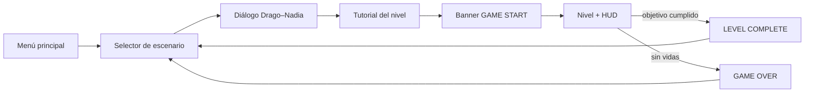
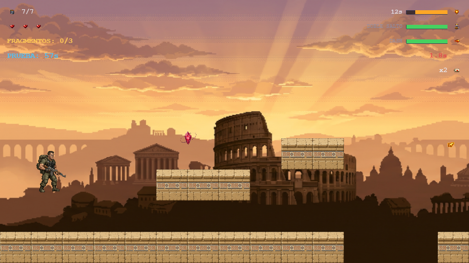
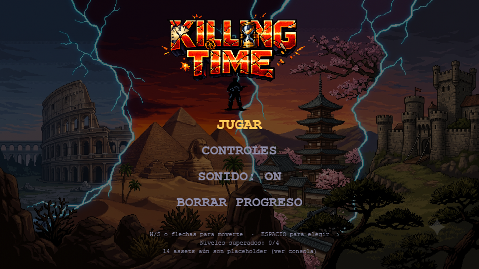
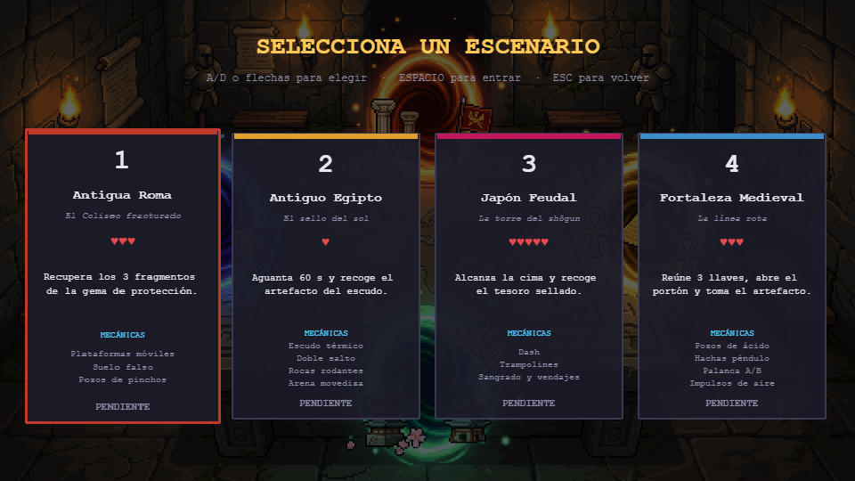
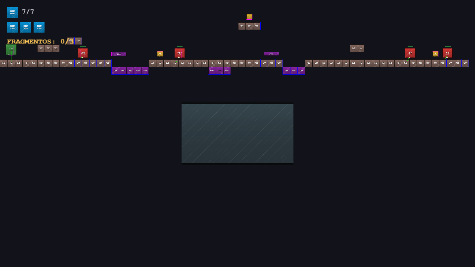
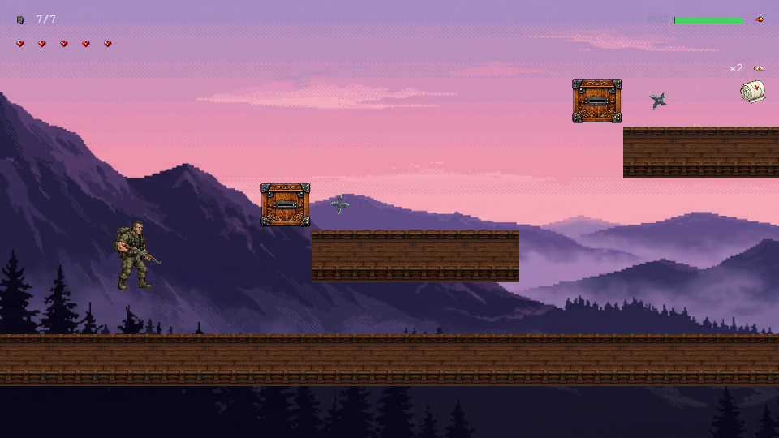
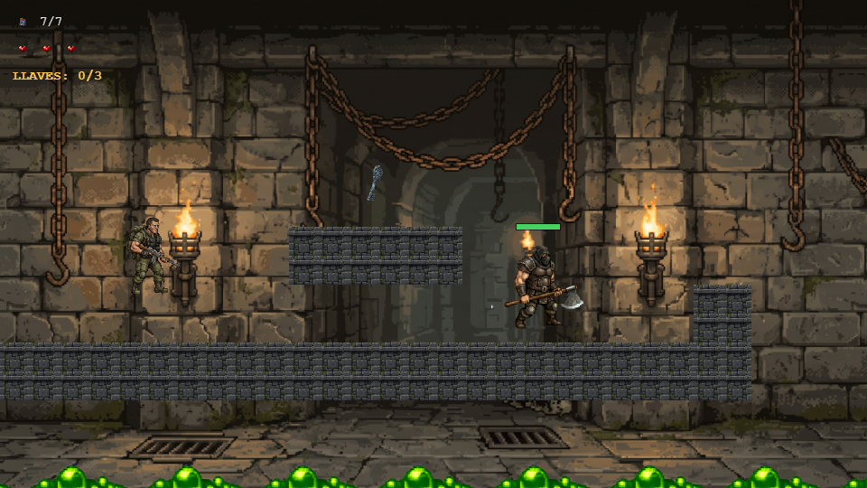
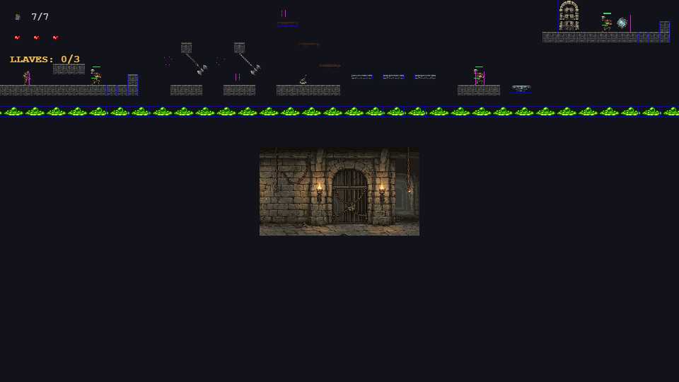
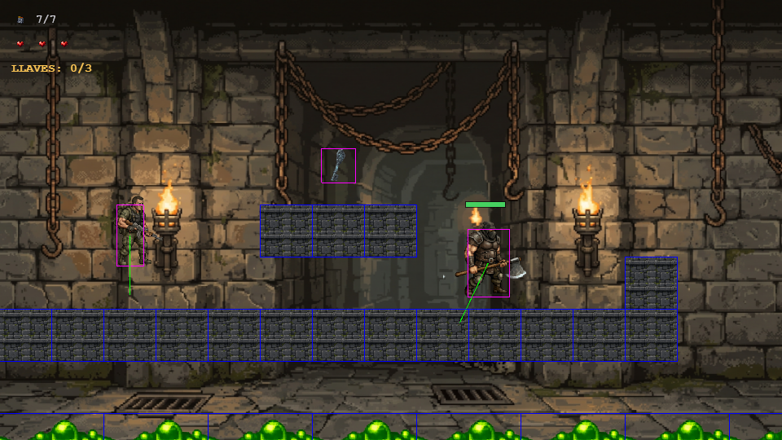

# GAME DESIGN DOCUMENT — KILLING TIME

**Versión 2.0**

Plataformas-shooter 2D de un jugador a través de cuatro épocas históricas

---

## Datos del Equipo

| Integrante | Rol | Escenario asignado | Enemigo a su cargo |
|---|---|---|---|
| **Santos Villarreal** | Nivel 1 | Antigua Roma — *El Coliseo fracturado* | Soldado Romano |
| **Kevin Villacis** | Nivel 2 | Antiguo Egipto — *El sello del sol* | Momia |
| **Martin Posso** | Nivel 3 | Japón Feudal — *La torre del shōgun* | Ninja |
| **Erick Mideros** | Nivel 4 | Fortaleza Medieval — *La línea rota* | Verdugo |

| | |
|---|---|
| **Materia** | Desarrollo de Juegos Interactivos |
| **Motor** | Phaser 3.90 (Arcade Physics) |
| **Lenguaje** | JavaScript con módulos ES, sin bundler |
| **Año** | 2026 |
| **Repositorio** | _(pendiente de publicar)_ |

Cada integrante es responsable del diseño, la implementación y las mejoras de su
escenario y de su enemigo. Los sistemas compartidos (jugador, HUD, audio,
guardado) se construyeron sobre una base común para que las cuatro épocas se
comporten igual en lo esencial.

---

## 01 / VISIÓN — Resumen ejecutivo

**Killing Time** es un plataformas-shooter 2D de un solo jugador. Drago, un soldado
enviado a través de portales temporales, recupera las gemas de protección que
sostenían cuatro épocas históricas antes de que el coronel Viktor Kaelen las
fracture con el dispositivo KT.

Cada escenario está diseñado para una sesión de 6 a 8 minutos y plantea una
**presión distinta**: no cambia solo el decorado, cambia qué te mata y cómo se
administra el riesgo.

| | |
|---|---|
| **Género** | Plataformas de acción / run-and-gun, un jugador |
| **Plataforma** | Navegador de escritorio (WebGL o Canvas) |
| **Resolución** | 960 × 540 escalada con `Phaser.Scale.FIT` |
| **Duración** | 6-8 minutos por escenario; 4 escenarios |
| **Público objetivo** | Estudiantes y jugadores casuales familiarizados con el plataformas de acción clásico (referencia: Metal Slug), en teclado |

### Propuesta de valor

- **Una mecánica de riesgo por época**: cada nivel enseña un sistema nuevo en lugar de repetir el mismo con otra piel.
- **Dificultad expresada en vidas**: 3, 1, 5 y 3 vidas comunican de entrada el tipo de tensión de cada escenario.
- **Identidad histórica**: Roma, Egipto, Japón feudal y una fortaleza medieval en pixel art de 16 bits.
- **Trazabilidad**: toda constante de balance vive en un único archivo y cada travesía está verificada contra la física real del salto.

### Pilares de diseño

| Pilar | Aplicación |
|---|---|
| Cada época, un peligro | El nivel 2 mata por tiempo, el 3 por acumulación, el 4 por geometría. |
| Peligro anunciado | El verdugo avisa antes de embestir, las plataformas de aire brillan antes de lanzar, las losas falsas parpadean antes de ceder. |
| Aritmética antes que intuición | Toda travesía se comprueba contra el alcance real del salto antes de darla por jugable. |

---

## 02 / FLUJO GLOBAL DEL JUEGO

| | |
|---|---|
| **Condición de fin de nivel** | Completar el objetivo del escenario |
| **Condición de derrota** | Agotar las vidas del nivel → pantalla GAME OVER → vuelta al selector |
| **Vidas por nivel** | 3 (Roma) · **1** (Egipto) · 5 (Japón) · 3 (Medieval) |
| **Progresión** | Los niveles superados se guardan en `localStorage` y el selector los marca |
| **Reaparición** | Al perder una vida se vuelve al inicio del mapa; **lo ya recogido sigue recogido** |
| **Reinicio total** | Solo al reingresar al nivel desde el selector tras perder todas las vidas |

El juego mide el avance por **escenarios superados**, no por puntuación: los cuatro
niveles son accesibles desde el principio y cada uno se marca como completado de
forma independiente.

### Flujo de escenas



Cada eslabón se salta solo si su escena todavía no existe, de modo que el flujo
funcionaba ya con el proyecto a medio construir.

---

## 03 / NARRATIVA — Historia y mundo

Cuatro **gemas de protección** sostienen los puntos de anclaje de la línea
temporal, una por época. El coronel **Viktor Kaelen** activa el dispositivo **KT** y
las fractura, sembrando cada era de enemigos corrompidos por esquirlas de gema y de
máquinas que no deberían existir allí.

**Drago**, soldado checheno, es enviado por los portales para recuperar los
artefactos de cada época. **Nadia**, analista temporal, le guía por radio y le
fabrica el equipo especial que cada era exige.

### Conflicto principal

Kaelen no aparece en ninguno de los cuatro escenarios: aparece su obra. La
fortaleza medieval del cuarto nivel **no está en ningún registro histórico** — la
construyó él. Recuperar el artefacto que hay tras su portón es lo que cierra la
línea temporal.

### Estructura dramática

| Acto | Momento jugable | Resultado narrativo |
|---|---|---|
| I — La fractura | Nivel 1: Coliseo de Roma | Se recomponen los tres fragmentos de la primera gema. |
| II — El sello | Nivel 2: desierto de Egipto | Se libera el artefacto que protege la ciudad. |
| III — La torre | Nivel 3: torre del shōgun | Se recupera el tesoro sellado de la era. |
| IV — La línea rota | Nivel 4: fortaleza de Kaelen | El artefacto final cierra la línea temporal. |

> **Tono:** militar y sobrio. Nadia informa, no dramatiza; Drago responde con
> frases cortas. La tecnología temporal es peligrosa, no mágica.

---

## 04 / FICHA DE PERSONAJES

| Personaje | Descripción visual | Implementado por | Aparición |
|---|---|---|---|
| **Drago** | Soldado checheno, uniforme verde oliva, chaleco táctico, rifle de asalto. Hojas de 6 frames a 128×128 px (*idle*, *walk*, *shoot*). | Base común | Los 4 niveles (jugable) |
| **Nadia** | Analista temporal; equipo militar con brazaletes de runas y amuleto de gema. Retrato 512×512. | Base común | Diálogos previos a cada nivel |
| **Viktor Kaelen** | Coronel de uniforme oscuro con insignias de tecnología temporal. Retrato 512×512. | Base común | Diálogos (nunca como jefe jugable) |
| **Soldado Romano** | Legionario de bronce con esquirla de gema roja en el pecho; lanza y escudo. | **Santos Villarreal** | Nivel 1 |
| **Momia** | Vendajes rasgados con energía verde maldita filtrándose por las grietas. | **Kevin Villacis** | Nivel 2 |
| **Ninja** | Traje azul marino con faja roja, wakizashi y bolsa de shuriken; ojos rojos de control mental. | **Martin Posso** | Nivel 3 |
| **Verdugo** | Corpulento, cuero oscuro, capucha y hacha sobredimensionada. | **Erick Mideros** | Nivel 4 |

### Principios de lectura visual

- Drago mantiene la **misma silueta y controles** en los cuatro niveles: lo que cambia es el entorno y la habilidad concedida.
- Los enemigos se distinguen por época, pero **todos mueren a 3 impactos**, así que el jugador nunca duda de cuánto aguanta uno.
- Cada enemigo lleva **barra de vida flotante** (verde → naranja → rojo) dibujada por código, sin depender de assets.
- Los estados importantes se anuncian con **color y forma**: rojo y vibración antes de una embestida, gris parpadeante durante un aturdimiento, tinte cian durante el dash, parpadeo de alfa durante la invulnerabilidad.

### Estadísticas de enemigos

Todos comparten 3 puntos de vida y son **inmunes a las trampas del escenario**: los
pinchos, el ácido y las hachas solo afectan a Drago.

| Enemigo | Patrulla | Persecución | Detección | Conducta distintiva |
|---|---|---|---|---|
| Soldado Romano | 90 px/s | 250 px/s | 150 px | Carga con la lanza al detectar; ataque cada 900 ms. |
| Momia | 150 px/s | 150 px/s | 260 px | **No se queda muerta**: cae 3 s y se levanta con la vida completa. |
| Ninja | 120 px/s | 200 px/s | 340 px | Shuriken de lejos (cada 1,8 s); wakizashi por debajo de 60 px. |
| Verdugo | 70 px/s | 300 px/s (embestida) | 220 px | Avisa 500 ms, embiste en línea recta, queda **aturdido 1 s** al chocar. |

---

## 05 / MECÁNICAS — Reglas del juego

### Bucle principal

Avanzar → leer el peligro anunciado → disparar o esquivar → resolver la mecánica
propia del nivel → recoger el objetivo → completar el escenario.

### Sistemas comunes a los cuatro niveles

| Sistema | Regla |
|---|---|
| Movimiento | 200 px/s en horizontal. Gravedad global 800 px/s². |
| Salto | 3 tiles de altura (192 px), solo con los pies en el suelo. |
| Disparo | Proyectil frontal a 700 px/s; cadencia máxima de 200 ms. |
| Munición | Cargador de 7 balas, recarga automática de 1,2 s, recargas infinitas. |
| Apuntado | W dispara hacia arriba; S hacia abajo en el aire; si no, hacia donde mira. |
| Daño | Un impacto cuesta una vida, con 800 ms de invulnerabilidad y parpadeo. |
| Pausa | ESC congela físicas **y temporizadores** del nivel; M vuelve al selector. |

### La aritmética del salto

Las alturas se derivan de la rejilla de 64 px con `jumpVelocityForTiles(n)`, que
traduce "quiero saltar N bloques" a la velocidad necesaria (`v = √(2·g·h)`). Estos
son los límites que condicionan **todo** el diseño de niveles:

| Impulso | Altura | Velocidad | Alcance horizontal |
|---|---|---|---|
| Salto normal | 192 px (3 tiles) | −554 | 277 px (4,3 tiles) |
| Doble salto (nivel 2) | +192 px encadenados | −554 | — |
| Trampolín (nivel 3) | 448 px (7 tiles) | −847 | — |
| Impulso de aire (nivel 4) | 384 px (6 tiles) | −784 | — |

> **Regla de diseño derivada:** sin plataforma auxiliar, ningún hueco puede pasar de
> **3 tiles (192 px)**. Uno de 4 tiles deja 21 px de margen —inservible en la
> práctica— y uno de 5 tiles es matemáticamente imposible.

### Habilidades por época

| Habilidad | Nivel | Parámetros |
|---|---|---|
| **Doble salto** | 2 | Segunda pulsación de ESPACIO en el aire. Enfriamiento de 5 s. |
| **Dash** | 3 | 600 px/s durante 200 ms, **invulnerable mientras dura**. Enfriamiento de 5 s. |

---

## 06 / INTERFAZ — Controles y HUD

### Controles

| Acción | Tecla | Alternativa |
|---|---|---|
| Mover | A / D | ← / → |
| Apuntar arriba / abajo | W / S | ↑ / ↓ |
| Saltar (y doble salto) | ESPACIO | — |
| Disparar | J | — |
| Interactuar (palanca, vendaje) | E | — |
| Dash | SHIFT | — |
| Pausa | ESC | — |
| Volver al selector (en pausa) | M | — |

El juego se completa **sin ratón**. Los menús aceptan teclado y puntero.

### HUD configurable por nivel

El HUD corre como **escena paralela** al nivel, de modo que no le afecta el
desplazamiento de cámara ni la pausa de físicas. Cada nivel declara sus widgets:

| Nivel | Widgets |
|---|---|
| 1 — Roma | Munición, vidas, contador de fragmentos |
| 2 — Egipto | Munición, temporizador, **barra de escudo térmico**, doble salto, **brújula** |
| 3 — Japón | Munición, vidas, dash, **estado de sangrado**, vendajes |
| 4 — Medieval | Munición, vidas, contador de llaves |

El nivel 2 **sustituye las vidas por la barra de escudo**: con una sola vida un
contador de vidas no aporta información, y el escudo sí es lo que va a matarte.

### Criterios UX

| Criterio | Solución |
|---|---|
| Lectura en acción | Iconos con texto redundante; el color nunca es el único canal. |
| Aprendizaje | Panel de tutorial por nivel antes de jugar, con las teclas implicadas. |
| Peligro justo | Todo golpe fuerte tiene aviso previo visible. |
| Orientación | Brújula al borde de la pantalla cuando el objetivo del nivel 2 queda fuera de cámara. |
| Recuperación | Pausa reversible; el progreso recogido sobrevive a perder una vida. |



---

## 07 / OBJETOS Y TRAMPAS

### Objetivos y consumibles

| Elemento | Nivel | Efecto |
|---|---|---|
| Fragmento de gema | 1 | Objetivo: 3 fragmentos completan el nivel. |
| Talismán solar | 2 | Reinicia el escudo térmico a 15 s y **reaparece en otro punto válido**. |
| Artefacto de la ciudad | 2 | Objetivo: se libera al cumplirse el minuto de supervivencia. |
| Vendaje | 3 | Detiene el sangrado (1 unidad) o se canjea por una vida (2 unidades). |
| Tesoro del shōgun | 3 | Objetivo: está en la cima de la torre. |
| Llave del rey | 4 | 3 llaves abren el portón final. |
| Artefacto temporal | 4 | Objetivo final: cierra la línea temporal. |

### Trampas por época

| Trampa | Nivel | Comportamiento |
|---|---|---|
| Pinchos | 1 | Al fondo de los acantilados. Cuestan una vida. |
| Suelo falso | 1 | Cede **1 s** después de pisarlo, parpadeando. Si te apartas antes, se recompone. |
| Plataforma móvil | 1 | Recorrido por tween: 200 px / 3 s horizontal, 150 px / 2,5 s vertical. |
| Arena movediza | 2 | Reduce la velocidad a la mitad. Pararse 2 s dentro te atrapa: **10 pulsaciones de salto en 3 s** para salir. |
| Roca rodante | 2 | Baja de las colinas cada 3-5 s a 260 px/s. Un toque acaba el nivel. |
| Trampa de shuriken | 3 | Panel de pared que dispara cada 2-3 s con trayectoria fija. |
| Trampolín | 3 | Impulsa 7 tiles al caer sobre él. |
| Foso de ácido | 4 | Cubre todo el fondo del mapa: la fortaleza es un conjunto de islas. |
| Hacha péndulo | 4 | Oscila ±45° cada 1,5 s. **Solo el filo hace daño**, no la cadena. |
| Palanca A/B | 4 | Intercambia dos grupos de plataformas: el puente y la escalera a la 3ª llave. |
| Plataforma de aire | 4 | Lanza 6 tiles cada 3 s, con **600 ms de aviso luminoso**. |

### El sistema de sangrado (nivel 3)

Los shuriken **no quitan vida**: provocan un sangrado que mata en 5 s si no te
vendas. Es el sistema con más casuística del juego y sus siete reglas viven
aisladas en un módulo propio para poder auditarlas:

| # | Situación | Consecuencia |
|---|---|---|
| R1 | Shuriken sin sangrar | Empieza el sangrado. No cuesta vida. |
| R2 | Shuriken **ya sangrando** | Cuesta 1 vida y el sangrado continúa… salvo que te deje en 1 vida, entonces se corta. |
| R3 | Se agotan los 5 s | Cuesta 1 vida y el sangrado se corta. |
| R4 | Cuerpo a cuerpo **sangrando** | Te deja en 1 vida, vengas de las que vengas, y corta el sangrado. |
| R5 | Cuerpo a cuerpo sin sangrar | Cuesta 1 vida. |
| R6 | E sangrando, con vendajes | Gasta 1 vendaje y corta el sangrado. |
| R7 | Doble E sin sangrar | Gasta 2 vendajes y recupera 1 vida (máximo 5). |

Se empieza con 2 vendajes y hay 3 más repartidos por el mapa.

---

## 08 / PLANIFICACIÓN DE NIVELES

Reparto de escenarios y las **tres mecánicas** que cada integrante implementó en el
suyo.

| Nivel / Integrante | Escenario | Enemigo | Las 3 mecánicas implementadas |
|---|---|---|---|
| **Nivel 1**<br>*Santos Villarreal* | Antigua Roma<br>Coliseo al atardecer, mapa lineal de 3 secciones (4032 × 640 px) | **Soldado Romano**<br>Legionario con esquirla de gema; patrulla y carga con la lanza | **1. Plataformas móviles:** recorrido por tween con el cuerpo inamovible; el jugador se arrastra sumando el desplazamiento del frame, porque Arcade no propaga el movimiento de un cuerpo que no se mueve por física.<br>**2. Suelo falso:** losas que ceden 1 s después de pisarlas, con parpadeo de aviso; si el jugador se aparta antes, se recomponen.<br>**3. Pozos de pinchos:** acantilados que cuestan una vida; el primero mide 5 tiles y **obliga** a usar la plataforma móvil. |
| **Nivel 2**<br>*Kevin Villacis* | Antiguo Egipto<br>Arena abierta con dos colinas y dos valles (3584 × 640 px) | **Momia**<br>Revive 3 s después de caer; máximo 4 activas | **4. Escudo térmico:** cuenta de 15 s que solo reinician los talismanes solares, con 2 s de gracia antes de morir de calor. Con **una sola vida**, es el reloj que gobierna el nivel.<br>**5. Supervivencia en dos fases:** 60 s de oleadas de momias y rocas rodantes; al cumplirse el minuto se libera el artefacto de la ciudad y la maldición se apaga.<br>**6. Arena movediza:** reduce la velocidad a la mitad y atrapa a quien se pare 2 s; salir exige 10 pulsaciones de salto en 3 s. |
| **Nivel 3**<br>*Martin Posso* | Japón Feudal<br>Torre **vertical** de ascenso en zigzag (3200 × 1408 px) | **Ninja**<br>Shuriken a distancia, wakizashi de cerca | **7. Dash con invencibilidad:** 600 px/s durante 200 ms; sirve tanto para cruzar huecos como para atravesar una cortina de shuriken. Enfriamiento de 5 s.<br>**8. Trampolines:** impulsan 7 tiles. El último tramo hasta la cima son 4 filas de golpe: **solo se sube con trampolín**.<br>**9. Sangrado y vendajes:** los shuriken no quitan vida, provocan un sangrado de 5 s con siete reglas de interacción (ver sección 07). |
| **Nivel 4**<br>*Erick Mideros* | Fortaleza Medieval<br>Islas sobre un foso de ácido continuo (4032 × 768 px) | **Verdugo**<br>Avisa, embiste y se aturde al chocar | **10. Foso de ácido y hachas péndulo:** no hay suelo continuo, todo hueco mata. Las hachas oscilan ±45° y **solo el filo golpea**, con hitbox circular separado de la cadena.<br>**11. Palanca A/B:** intercambia dos grupos de plataformas mágicas —el puente hacia delante y la escalera a la tercera llave—; hay que accionarla al menos dos veces.<br>**12. Plataformas de impulso de aire:** lanzan 6 tiles cada 3 s, con 600 ms de aviso luminoso para poder anticiparlas. |

---

## 09 / DISEÑO DE NIVELES

Los cuatro mapas se declaran por **(columna, fila)** sobre una rejilla de 64 px al
principio de cada escena, de modo que mover un pozo o una repisa es editar un array.

| Nivel | Dimensiones | Vidas | Presión dominante |
|---|---|---|---|
| 1 — Antigua Roma | 4032 × 640 px | 3 | Geometría: plataformas y trampas de suelo |
| 2 — Antiguo Egipto | 3584 × 640 px | **1** | Tiempo: el escudo térmico |
| 3 — Japón Feudal | 3200 × **1408** px | 5 | Acumulación: el sangrado |
| 4 — Fortaleza Medieval | 4032 × 768 px | 3 | Precisión: todo hueco es mortal |

### Menú y selector

| | |
|---|---|
|  |  |
|  |  |

### Nivel 1 — Antigua Roma · *Santos Villarreal*

```
 A: patio y repisas          B: islas y suelo falso         C: tramo final
[========]  ~~~~~  [=====]  [FFF]  [=====]  ~~~  [==============]
 0-14      15-19    20-27   28-30   31-37  38-40      41-62
            ↑                 ↑              ↑
     plataforma móvil    losas falsas    salto de 3 tiles
     (5 tiles: obligatoria)
```

El **primer acantilado mide 5 tiles**: imposible de saltar, obliga a usar la
plataforma móvil. El segundo mide 3 y se cruza de un salto con 85 px de margen. Los
tres fragmentos están tras la plataforma horizontal, en una repisa que solo se
alcanza con la plataforma vertical, y al final custodiados por dos legionarios.

| | |
|---|---|
|  |  |

### Nivel 2 — Antiguo Egipto · *Kevin Villacis*

```
 [meseta]\__  valle  __/[plataformas]\__  valle  __/[meseta]
  0-6  7-8   14-18 arena   20-24 / 26-29 / 31-35   36-40   47-55
   ↑                              ↑                          ↑
 rocas ruedan            centro elevado              rocas ruedan
```

Suelo continuo de lado a lado: aquí no se cae, se muere de calor. Dos fases: 60 s de
supervivencia y después el artefacto en el centro.

| | |
|---|---|
|  |  |

### Nivel 3 — Japón Feudal · *Martin Posso*

```
                                   [==== cima ====] ← tesoro
                            [P6]───┘  ↑ trampolín obligatorio
                     [P5]
              [P4]
       [P3]
  [P2]
[P1]
[============ patio ============]      (a partir de aquí, vacío)
```

El único nivel **vertical**. Cada plataforma queda 128 px por encima de la anterior;
las cuatro trampas de pared barren las plataformas a la altura del pecho.

| | |
|---|---|
|  |  |

### Nivel 4 — Fortaleza Medieval · *Erick Mideros*

```
[== patio ==]  [isla] [isla]  [== palanca ==]  [antesala] [== galería ==]
  0-12          16-18  21-23      26-31          43-46        52-62
      ↑           ↑  ↑              ↑    ↑           ↑        ↑      ↑
   verdugo     hachas péndulo   grupo B  grupo A  impulso  portón artefacto
                                (escalera) (puente)  de aire
~~~~~~~~~~~~~~~~~~~~ ÁCIDO (todo el fondo) ~~~~~~~~~~~~~~~~~~~~
```

La escalera del grupo B sube hacia la **izquierda** a propósito: al caerse de ella
se aterriza en el suelo firme de la sala de la palanca y no en el ácido.

| | |
|---|---|
|  |  |

### Curva de dificultad

| Nivel | Sistemas simultáneos | Qué se aprende |
|---|---|---|
| 1 | Movimiento, disparo, plataformas | Los fundamentos y a desconfiar del suelo. |
| 2 | + gestión de tiempo, doble salto, oleadas | Administrar un recurso que se agota mientras te persiguen. |
| 3 | + dash, sangrado, verticalidad | Que el daño puede ser diferido y curable. |
| 4 | + geometría mortal, estados del escenario | Combinar todo con precisión, sin margen de error. |

---

## 10 / ARTE Y AUDIO

### Lenguaje visual

| Componente | Decisión |
|---|---|
| Estilo | Pixel art de 16 bits, referencia Metal Slug: colores saturados, contornos negros, sombreado de contraste duro. |
| Personajes | Hojas de 6 frames a 128×128 px con estados *idle*, *walk* y *attack*. |
| Fondos | Parallax por época (1920×540) con factores de scroll 0,2 / 0,5 / 0,9. |
| Terreno | Texturas tileables de 64×64 px, una por época. |
| Feedback | Tinte y parpadeo para estados; destellos de cámara en los momentos clave. |

La capa **cercana** del parallax se dibuja **delante del jugador** como decoración de
primer plano, y el motor la descarta automáticamente si detecta que es opaca (ver
sección 11).

### Audio

19 pistas MP3: 10 de música, 3 jingles de evento y 6 efectos.

| Grupo | Pistas |
|---|---|
| Música | Carga, menú, selector, diálogo, tutorial, cómic, y una por cada nivel |
| Jingles | GAME START, LEVEL COMPLETE, GAME OVER |
| Efectos | Disparo, recarga, salto, daño, recolección, muerte de enemigo |

Decisiones que definen el sistema:

- **La música no se corta entre escenas, se sustituye** con fundido: no hay silencios en la cadena menú → diálogo → tutorial → nivel.
- **Una pista que falte no es un error**: se ignora en silencio, igual que con los placeholders gráficos.
- Los fundidos van sobre `requestAnimationFrame` y **no sobre tweens de escena**, por el motivo documentado en la mejora #8.

---

## 11 / TÉCNICA — Arquitectura

| Capa | Tecnología | Responsabilidad |
|---|---|---|
| Motor | Phaser 3.90 (CDN) | Arcade Physics, escenas, grupos, colisiones, tweens y audio. |
| Código | JavaScript con módulos ES | 45 módulos, una clase por archivo, sin bundler. |
| Ejecución | Servidor HTTP estático | Los módulos ES exigen HTTP; no hay build ni `npm install`. |
| Persistencia | `localStorage` | Niveles superados y ajustes de audio. |

```
src/
  config/    Constantes de balance, fichas de nivel, manifiestos, guiones
  scenes/    Boot, Preload, menús, diálogo, tutorial, banner, HUD, 4 niveles
  entities/  Jugador, bala, base de enemigos + 4 enemigos, 6 trampas
  systems/   Input, vidas, munición, cooldowns, sangrado, audio, guardado
```

### Decisiones de arquitectura

**`BaseLevelScene` como esqueleto.** Concentra parallax, jugador, balas, cámara, HUD,
pausa, reaparición, banners y fin de nivel. Una `LevelXScene` solo implementa seis
ganchos: `buildTerrain()`, `buildLevel()`, `updateLevel()`, `resetEnemies()`,
`getSpawnPoint()` y `getHudState()`. Sin esto, cada cambio transversal habría que
replicarlo cuatro veces — y cada integrante trabaja su nivel sin pisar los otros.

**Toda la dificultad en un archivo.** `GameConfig.js` contiene cada velocidad,
enfriamiento y temporizador. Ajustar el balance no requiere abrir ninguna escena.

**Manifiesto de assets con placeholders procedurales.** Los 78 assets declaran ruta,
dimensiones y número de frames. Si un archivo no existe, se genera por código una
textura con la misma clave y dimensiones. El juego fue jugable de principio a fin
**antes de tener una sola imagen**.

**El estado se reinicia en `init()`, no en el constructor.** Phaser reutiliza las
instancias de escena entre partidas, así que el constructor solo corre una vez por
sesión.

### Robustez

Dos correcciones **transversales** a los cuatro niveles, no atribuibles a un solo
escenario:

| Problema | Solución |
|---|---|
| Sin dispositivo de audio, `decodeAudioData` no resuelve ni rechaza nunca: el loader no terminaba y el jugador se quedaba en la pantalla de carga para siempre. | **Detector de atasco** de 12 s que se reinicia con cada archivo que llega, así que distingue "lento" de "colgado". Usa `window.setTimeout` porque el reloj de la escena no avanza durante la carga. |
| `level1_near.png` se entregó **100 % opaca**; al ir delante del jugador tapaba el nivel entero. | `isUsableForeground()` muestrea una rejilla de píxeles y **descarta cualquier capa de primer plano opaca**, avisando por consola. |

Además: el debug de físicas **nunca** está activo por defecto (solo con `?debug=1`), y
balas y proyectiles se reciclan en pools.



### Atajos de desarrollo

| Querystring | Efecto |
|---|---|
| `?debug=1` | Dibuja las cajas de colisión |
| `?scene=Level3Scene&level=3` | Arranca en una escena concreta |
| `?skipIntro=1` | Entra al nivel sin el banner |
| `?zoom=0.235` | Aleja la cámara para revisar el trazado completo de un mapa |

### Compatibilidad

Navegadores de escritorio modernos con WebGL o Canvas y teclado. Resolución interna
fija de 960×540 escalada con `Phaser.Scale.FIT`.

---

## 12 / ALCANCE Y RIESGOS

### Dentro del alcance

Cuatro escenarios completos y jugables de principio a fin, con enemigo propio,
mecánicas propias, diálogo, tutorial, HUD específico, música y efectos.

### Fuera del alcance

| Elemento | Motivo |
|---|---|
| Sistema de puntuación | El progreso se mide por escenarios superados. No se implementó. |
| Confrontación final con Kaelen | Era opcional en la especificación; aparece solo en los diálogos. |
| `IntroComicScene` | Los 5 paneles de la historieta de apertura no se produjeron. |
| Soporte táctil y de mando | El juego es de teclado de escritorio. |

### Riesgos identificados

| Riesgo | Estado |
|---|---|
| **Balance del nivel 2**: una sola vida con 60 s de supervivencia puede resultar excesivo. | Abierto. Todas sus constantes están en `LEVEL2` para ajustarlo sin tocar lógica. |
| **Peso del audio**: 14 MB se cargan antes de empezar. `music_level1.mp3` pesa 4,8 MB frente a los 727 KB del resto. | Mitigado con el detector de atasco; conviene reexportar esa pista. |
| **Capas de parallax incompletas**: los niveles 1-3 muestran solo la capa lejana. | Abierto. El motor las omite sin romper nada. |
| **Assets sin usar**: `nadia_idle`, `muzzle_flash` e `intro_panel_1..5` no existen. | Sin impacto: ningún código los usa. |

---

## 13 / PLAYTESTING — Bitácora e informe

### Protocolo

Cada integrante completó **tres corridas consecutivas de su propio escenario** y
registró el hallazgo que más le estorbó. Sobre esa bitácora se aplicaron tres
métodos de verificación:

1. **Comprobación aritmética previa.** Cada travesía se verifica contra el alcance real del salto (192 px de alto, 277 px de largo) con un script que imprime el margen de cada uno.
2. **Pruebas unitarias de lógica.** Los sistemas que no dependen de Phaser (sangrado, munición, audio) se prueban aislados con objetos simulados.
3. **Renderizado y medición.** Capturas del juego en ejecución para la maquetación, y decodificación directa de los PNG para medir dimensiones y transparencia.

> Las **fechas y duraciones son una plantilla**: hay que ajustarlas a las sesiones
> efectivas de cada integrante antes de la entrega. Los hallazgos sí son los
> detectados realmente durante el desarrollo.

---

### Santos Villarreal — Nivel 1

#### Corrida 1

| Nivel | Categoría | Problema encontrado | Propuesta de mejora |
|---|---|---|---|
| 1 | **Bug crítico** | El juego se congelaba por completo al disparar a un legionario. La bala quedaba inmóvil junto a él y su barra de vida intacta. | Investigar por qué se rompe el bucle de render al aplicar daño; el error no está en la lógica de daño sino en cómo llega el callback de colisión. |

#### Corrida 2

| Nivel | Categoría | Problema encontrado | Propuesta de mejora |
|---|---|---|---|
| 1 | **Diseño de niveles** | El segundo acantilado era imposible de cruzar: no había plataforma y el salto no llegaba ni con carrerilla. Bloqueo total del nivel. | Medir el alcance real del salto y ajustar el ancho del hueco a esa cifra, con margen suficiente para no depender de un salto perfecto. |

#### Corrida 3

| Nivel | Categoría | Problema encontrado | Propuesta de mejora |
|---|---|---|---|
| 1 | **Diseño de niveles** | La repisa del segundo fragmento no se alcanzaba ni subiendo en la plataforma vertical; además el salto chocaba contra algo invisible. | Bajar la repisa y desplazar la plataforma para que el salto sea diagonal y no contra la cara inferior de la propia repisa. |

---

### Kevin Villacis — Nivel 2

#### Corrida 1

| Nivel | Categoría | Problema encontrado | Propuesta de mejora |
|---|---|---|---|
| 2 | **Bug de diseño** | El talismán del escudo apareció flotando bajo las mesetas, en un hueco cerrado. Imposible llegar; muerte por calor sin ninguna opción. | Validar que los puntos de reaparición sean accesibles, no solo que tengan superficie sólida debajo. |

#### Corrida 2

| Nivel | Categoría | Problema encontrado | Propuesta de mejora |
|---|---|---|---|
| 2 | **Balance** | Aun estando accesible, el talismán aparecía a veces en el extremo opuesto del mapa: los 15 s del escudo no daban para llegar cruzando arena movediza. | Limitar la distancia de reaparición a un radio que sea alcanzable dentro de la duración del escudo. |

#### Corrida 3

| Nivel | Categoría | Problema encontrado | Propuesta de mejora |
|---|---|---|---|
| 2 | **Interfaz / Bug** | Tras pausar, la barra de escudo del HUD y el escudo real dejaban de coincidir; el indicador del doble salto también se desfasaba. | Unificar la fuente de tiempo: el HUD y los temporizadores deben leer el mismo reloj, y ese reloj debe congelarse con la pausa. |

---

### Martin Posso — Nivel 3

> Los tres hallazgos de este nivel corresponden a fallos **transversales** que se
> manifestaron aquí de forma especialmente visible; su corrección benefició a los
> cuatro escenarios.

#### Corrida 1

| Nivel | Categoría | Problema encontrado | Propuesta de mejora |
|---|---|---|---|
| 3 | **Animaciones** | Los ninjas caminaban mirando al lado contrario al que avanzaban, lo que hacía imposible anticipar hacia dónde iban a lanzar el shuriken. | Comprobar la orientación real de las hojas de sprites entregadas en lugar de fiarse de la especificación de arte, y corregir el volteo. |

#### Corrida 2

| Nivel | Categoría | Problema encontrado | Propuesta de mejora |
|---|---|---|---|
| 3 | **Audio (SFX / música)** | Al cadenar diálogo → tutorial → nivel se acumulaban varias músicas sonando encimadas, y el jingle de inicio seguía sonando sobre la música del nivel. No se entendía nada. | Los fundidos de audio no deben depender del ciclo de vida de la escena que los lanza. Añadir además un barrido de pistas huérfanas. |

#### Corrida 3

| Nivel | Categoría | Problema encontrado | Propuesta de mejora |
|---|---|---|---|
| 3 | **Físicas** | Con el arte definitivo, Drago y los ninjas parecían flotar unos píxeles sobre las plataformas de la torre. | Recalibrar las cajas de colisión midiendo el contenido real de los sprites, en lugar de asumir que rellenan el frame. |

---

### Erick Mideros — Nivel 4

#### Corrida 1

| Nivel | Categoría | Problema encontrado | Propuesta de mejora |
|---|---|---|---|
| 4 | **Físicas** | Las hachas péndulo hacían daño a media altura de la cadena, muy por encima del filo visible. Se moría sin tocar el hacha. | El hitbox debe cubrir solo el filo. Medir dónde está el filo dentro de la imagen y centrar el cuerpo circular ahí. |

#### Corrida 2

| Nivel | Categoría | Problema encontrado | Propuesta de mejora |
|---|---|---|---|
| 4 | **Bug** | Una vez corregida la altura, el hacha seguía golpeando donde no estaba: la zona de daño aparecía **reflejada** respecto al arco visible del péndulo. | Contrastar la trigonometría propia contra la matriz de transformación del motor en varios ángulos, no solo a 0°. |

#### Corrida 3

| Nivel | Categoría | Problema encontrado | Propuesta de mejora |
|---|---|---|---|
| 4 | **Diseño de niveles** | Al usar la plataforma de impulso manteniendo "derecha", el jugador se estrellaba contra el lateral de la galería del portón en lugar de subir por encima. | Separar la galería de la plataforma de impulso lo suficiente para que el arco entre bien tanto subiendo recto como avanzando desde el despegue. |

---

### Resultado del consenso

- **Prioridad absoluta a lo que rompe la partida**: la congelación al disparar y las travesías imposibles se corrigieron antes que cualquier ajuste estético.
- **Comprobar la geometría con números, no jugando**: dos de los tres bloqueos del nivel 1 eran aritméticamente imposibles y se habrían detectado antes con el script de márgenes.
- **No fiarse de la especificación de los assets**: la orientación de los sprites y la opacidad de las capas de fondo contradecían el documento de arte.
- **Anticipar todo golpe fuerte**: avisos previos en el verdugo, las plataformas de aire y las losas falsas.
- **Aislar la casuística compleja**: las siete reglas de sangrado en un módulo propio y con pruebas.

---

## 14 / MATRIZ DE ASIGNACIÓN

Las **12 mejoras** implementadas, tres por integrante, cada una en su escenario.

### Nivel 1 — Santos Villarreal

| Categoría | Problema encontrado | Mejora implementada |
|---|---|---|
| **Bug crítico** | Al disparar a un legionario, el juego se congelaba: la bala quedaba inmóvil y el enemigo intacto. | Se aisló el fallo con una prueba que llamaba a `takeBulletHit()` directamente (funcionaba) y luego por la vía real del `overlap` (fallaba). **Phaser invierte el orden de los argumentos** del callback cuando se mezcla un grupo con un array: con `overlap(grupoDeBalas, arrayDeEnemigos)` resuelve por `collideSpriteVsGroup` e invoca `cb(enemigo, bala)`. El `bullet.deactivate()` caía sobre un enemigo → `TypeError` → se rompía el bucle de render. Se creó `pairBy(Tipo, a, b)` en `systems/CollisionUtils.js`, que resuelve el par **por tipo y nunca por posición**. Se localizó y corrigió una segunda instancia del mismo error (balas contra losas falsas) que aún no se había manifestado. |
| **Diseño de niveles** | El segundo acantilado era imposible de cruzar; bloqueo total del nivel. | Se calculó el alcance real del salto: con gravedad 800 y velocidad −554 el vuelo dura 1,385 s, lo que a 200 px/s da **277 px de recorrido**. El hueco medía 5 tiles (320 px), matemáticamente imposible. Se redujo a **3 tiles (192 px)**, dejando 85 px de margen. Se descartó dejarlo en 4 tiles porque 256 px contra 277 px de alcance deja solo 21 px, un margen inservible en la práctica. Se verificaron de paso las siete travesías del nivel con un script que imprime el margen de cada una. |
| **Diseño de niveles** | La repisa del segundo fragmento no se alcanzaba ni con la plataforma vertical, y el salto chocaba con algo invisible. | Eran dos problemas superpuestos: la repisa estaba a 6 tiles del suelo (necesitaba 187 px de subida contra 192 px de salto máximo, margen inservible) **y la plataforma vertical estaba justo debajo de ella**, así que el salto chocaba contra su cara inferior. Se bajó la repisa a la fila 3 (5 tiles del suelo) y se desplazó la plataforma a la columna 36, a su derecha, para que el salto sea diagonal. Resultado: 86 px de margen de altura y 0,93 s por encima de la repisa para cubrir los 96 px horizontales. |

### Nivel 2 — Kevin Villacis

| Categoría | Problema encontrado | Mejora implementada |
|---|---|---|
| **Bug de diseño** | El talismán del escudo aparecía en huecos cerrados, imposibles de alcanzar; muerte por calor sin opción. | El cálculo de puntos de reaparición solo comprobaba *"celda sólida con hueco encima"*, y el suelo enterrado bajo las mesetas cumple esa condición aunque sea una cavidad sellada. Se añadió `isOpenToSky(columna, fila)`, que descarta toda superficie con algo sólido por encima hasta el borde del mapa. Es una prueba conservadora a propósito: descarta también huecos accesibles (los que hay bajo las plataformas centrales) antes que admitir uno imposible. Verificado replicando la geometría: **de 76 puntos candidatos quedan 46**, todos accesibles, repartidos por las cinco filas de superficie. |
| **Balance** | El talismán aparecía a veces al otro extremo del mapa; los 15 s del escudo no daban para llegar. | Se añadió `SHIELD_MAX_DISTANCE = 1600`, el radio máximo de reaparición. A 200 px/s son unos 8 s de carrera sobre los 15 s del escudo, con margen para trepar, esquivar momias y cruzar arena movediza (que reduce la velocidad a la mitad). Se comprobó que el filtro nunca se queda sin opciones: **en el peor rincón del mapa siguen habiendo 21 puntos válidos dentro del radio**. Si aun así no hubiera ninguno, la selección recae en cualquier punto accesible. |
| **Interfaz / Bug** | Tras pausar, la barra de escudo del HUD dejaba de coincidir con el escudo real; el indicador de doble salto también se desfasaba. | El método `update()` de Phaser recibe el tiempo del **bucle del juego**, pero `getHudState()` y todos los temporizadores usaban `this.time.now`, el reloj de la **escena** — que sí se congela al pausar. Se estaba pasando el primero al jugador y sus sistemas. Se unificó `BaseLevelScene.update()` para que use el reloj de escena y se documentó el motivo, porque es un error fácil de repetir: afectaba a la barra de recarga del arma, al escudo térmico y a los enfriamientos de doble salto y dash. |

### Nivel 3 — Martin Posso

| Categoría | Problema encontrado | Mejora implementada |
|---|---|---|
| **Animaciones** | Los ninjas caminaban mirando al lado contrario al que avanzaban. | El documento de arte especificaba que los enemigos mirasen a la **izquierda**, y `faceDirection()` se programó según esa especificación. Al abrir las hojas entregadas se comprobó que miran a la **derecha** (el ninja corre hacia la derecha, el legionario lleva el escudo a su derecha). Se invirtió la condición en `EnemyBase.faceDirection()`: `setFlipX(direction < 0)` en lugar de `> 0`. La corrección beneficia a los **cuatro enemigos**. Se aprovechó para corregir también el ángulo de caída de la momia, que tenía el mismo error de sentido. |
| **Audio** | Al cadenar escenas se acumulaban varias músicas sonando a la vez; el jingle de inicio seguía sonando sobre la música del nivel. | Los fundidos usaban `scene.tweens`, pero los sonidos de Phaser son **globales**: al terminar una escena Phaser destruye sus tweens, así que el `onComplete` que paraba la pista anterior nunca se ejecutaba. Una pista huérfana por transición. El peor caso era el jingle de GAME START (más de 30 s), cuyo fundido se lanzaba una línea antes de `scene.stop()`. Se reescribieron los fundidos sobre `requestAnimationFrame`, independiente de las escenas, más un barrido que corta cualquier pista `music_`/`jingle_` suelta al poner música nueva. Verificado con **20 comprobaciones** sobre sonidos simulados: encadenando las cinco escenas queda exactamente una pista viva en cada paso. |
| **Físicas** | Con el arte definitivo, Drago y los ninjas parecían flotar unos píxeles sobre las plataformas. | Las cajas de colisión estaban calibradas para los placeholders procedurales, que rellenaban el frame de 128×128 completo; los sprites reales traen margen transparente, así que el cuerpo terminaba por debajo de los pies. Se midió el **canal alfa** de cada hoja para localizar dónde acaba el contenido y se recalibraron las cinco alturas: Drago 100 px (pies en y=123), legionario 96 (y=120), momia 98 (y=122), ninja 101 (y=125) y verdugo 103 (y=127). Confirmado con captura en modo `?debug=1`: las cajas terminan exactamente en la superficie. |

### Nivel 4 — Erick Mideros

| Categoría | Problema encontrado | Mejora implementada |
|---|---|---|
| **Físicas** | Las hachas péndulo hacían daño a media cadena, muy por encima del filo visible. | `body.setCircle(r)` sin offsets no centra el círculo: lo deja pegado a la esquina superior izquierda del cuerpo. Sobre un sprite de 80×160 eso situaba la zona de daño **54 px más arriba**, en mitad de la cadena. Se sustituyó el sprite del hitbox por un `Zone` del tamaño exacto del círculo (2 × radio), donde el offset por defecto ya queda centrado. Para colocarlo se midió el arte fila por fila: la cadena ocupa y=0-116 con ~12 px de ancho y el filo va de y=117 a 154 ensanchándose a 77 px, con **centro en y=136 de 160**. Las constantes se derivan de esa medición en lugar de estar a ojo. |
| **Bug** | Corregida la altura, el hacha seguía golpeando donde no estaba: la zona de daño aparecía reflejada respecto al arco visible. | La primera prueba dio "desfase 0 px" porque comparaba la fórmula **contra sí misma**, y a 0° el seno vale 0, así que el error no se manifestaba. Al contrastarla contra `visual.getWorldTransformMatrix()` del propio motor apareció un **desfase de 182 px**: a −45° el filo se dibuja en x=1211 y el hitbox estaba en x=1029. La Y coincidía perfectamente. En Phaser, rotar un punto `(0, d)` un ángulo `a` lo lleva a `(−d·sin a, d·cos a)`: con las Y hacia abajo, un ángulo positivo desplaza a la **izquierda**. Faltaba el signo negativo en la X. Tras la corrección: **desfase de 0,00 px en los nueve ángulos del arco, en ambas hachas**. |
| **Diseño de niveles** | Al usar la plataforma de impulso manteniendo "derecha", el jugador se estrellaba contra el lateral de la galería del portón. | La galería empezaba justo pegada a la plataforma de impulso. Al mantener "derecha" desde el despegue, el jugador cruzaba su borde antes de haber subido los 320 px necesarios y chocaba de lado. Se desplazó el inicio de la galería a la columna 52, separándola 192 px de la plataforma. Verificado en los dos casos extremos: manteniendo "derecha" se cruza a y=128 (64 px por encima de la superficie), y subiendo recto para desplazarse después queda margen de sobra. Se confirmó además que el tramo **exige** el impulso: 320 px de subida contra los 192 px del salto normal. |

---

## 15 / ESTADO DEL PROYECTO

| Área | Estado |
|---|---|
| Escenarios jugables | **4 de 4**, completables de principio a fin |
| Módulos de código | 45, con sintaxis verificada |
| Assets gráficos | **64** integrados con dimensiones verificadas una a una |
| Audio | **19 de 19** pistas integradas y verificadas como archivos distintos |
| Mejoras implementadas | **12 de 12** (3 por integrante) |

### Pendiente

- Ajustar fechas y duraciones de la bitácora a las sesiones efectivas de cada integrante.
- Publicar el repositorio y añadir el enlace a la portada.
- Ajustar el balance del nivel 2 con datos de juego reales.
- Reexportar las capas `_mid` y `_near` del parallax si se quiere recuperar la profundidad de tres capas.

---

## Cómo ejecutar el proyecto

El juego usa **módulos ES**, que los navegadores bloquean al abrir el HTML con doble
clic. Hay que servirlo por HTTP desde la carpeta raíz:

```bash
npx serve             # o
python -m http.server # o la extensión Live Server de VS Code
```

No hay `npm install` ni proceso de compilación: Phaser se carga desde CDN.
